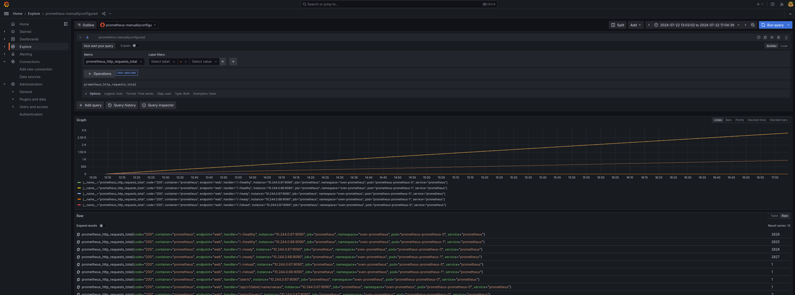

Previously, I installed both prometheus and grafana on my local cluster.
Now, I'm diverging a bit from the prometheus installation guide, which proposes that we push data from prometheus into grafana cloud.
Instead, I'll set up Grafana to scrape data from prometheus.

## Manual data source creation

First, I'll try the easy way by creating a prometheus datasource in the Grafana UI.
The Prometheus Server URL I need to use (since I've already set up a service for prometheus) is `http://prometheus.sven-prometheus.svc.cluster.local:9090`.
Sticking this in the relevant textbox makes Grafana succeed in querying Prometheus (the built-in test).

Now, I'll inspect some of the data that's available this way; later, I'll set up the connection from Grafana into Prometheus using config files instead of manually pressing buttons in the UI.

## Exploring the data

The Grafana explore view shows expected results when querying the `prometheus_http_requests_total` metric that prometheus exposes: an ever-increasing line for the http calls to the health endpoint, a less steep one for the metrics endpoint (this is prometheus scraping itself) and an almost horizontal one representing the `query` endpoint.

## Configuration through files 

Before going on, let's get rid of the manually created datasource named `prometheus` and create a new one using configuration files.

