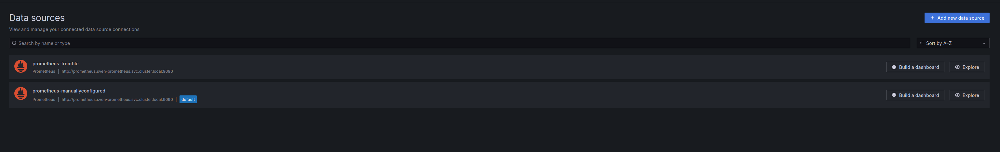
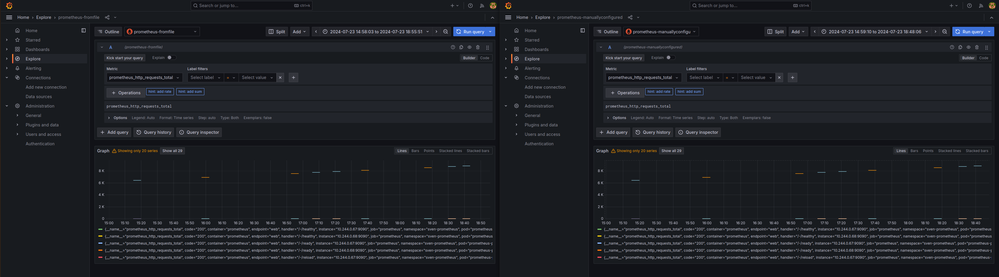

Previously, I installed both prometheus and grafana on my local cluster.
Now, I'm diverging a bit from the prometheus installation guide, which proposes that we push data from prometheus into grafana cloud.
Instead, I'll set up Grafana to scrape data from prometheus.

## Manual data source creation

First, I'll try the easy way by creating a prometheus datasource in the Grafana UI.
The Prometheus Server URL I need to use (since I've already set up a service for prometheus) is `http://prometheus.sven-prometheus.svc.cluster.local:9090`.
Sticking this in the relevant textbox makes Grafana succeed in querying Prometheus (the built-in test).

Now, I'll inspect some of the data that's available this way; later, I'll set up the connection from Grafana into Prometheus using config files instead of manually pressing buttons in the UI.

## Exploring the data

The Grafana explore view shows expected results when querying the `prometheus_http_requests_total` metric that prometheus exposes: an ever-increasing line for the http calls to the health endpoint, a less steep one for the metrics endpoint (this is prometheus scraping itself) and an almost horizontal one representing the `query` endpoint.


Note that this uses the `prometheus-manuallyconfigured` data source.

## Configuration through files 

The grafana documentation [states](https://grafana.com/docs/grafana/latest/administration/provisioning/#data-sources)

> You can manage data sources in Grafana by adding YAML configuration files in the provisioning/datasources directory. Each config file can contain a list of datasources to add or update during startup. If the data source already exists, Grafana reconfigures it to match the provisioned configuration file.

```
$ kubectl get pods -n sven-grafana
NAME                       READY   STATUS    RESTARTS   AGE
grafana-69946c9bd6-w9mmh   1/1     Running   0          19h

$ $ kubectl exec -it -n sven-grafana grafana-69946c9bd6-w9mmh  -- tree /etc/grafana/provisioning
/etc/grafana/provisioning
├── access-control
├── alerting
├── dashboards
├── datasources
├── notifiers
└── plugins


5 directories, 5 files
```

Now I create a `prometheus-fromfile` datasource using a configuration file. This should give me the same metrics as `prometheus-manuallyconfigured`; I can then get rid of the manually created datasource.

I found some [instructions](https://grafana.com/docs/grafana/latest/datasources/prometheus/) on provisioning prometheus data sources on grafana.
I'll adjust the provisioning example to my needs and store it in a configmap which I'll then mount in the grafana pod:

- I change the name
- I change the url
- I set cacheLevel to low
- I get rid of the `exemplarTraceIdDestinations` because I am not interested in them now.

```
$ cat <<EOF > prometheus-ds-configmap.yaml
apiVersion: v1
kind: ConfigMap
metadata:
  creationTimestamp: null
  name: prometheus-datasource
data:
  grafana-ds.yaml: |
    apiVersion: 1

    datasources:
      - name: prometheus-fromfile
        type: prometheus
        access: proxy
        # Access mode - proxy (server in the UI) or direct (browser in the UI).
        url: http://prometheus.sven-prometheus.svc.cluster.local:9090
        jsonData:
          httpMethod: POST
          manageAlerts: true
          prometheusType: Prometheus
          prometheusVersion: 2.44.0
          cacheLevel: 'Low'
          disableRecordingRules: false
          incrementalQueryOverlapWindow: 10m
EOF

$ kubectl apply -f prometheus-ds-configmap.yaml -n sven-grafana
configmap/prometheus-datasource created
```
I add a volume to the grafana deployment manifest based on this configmap:
```
        - name: grafana-prov-ds
          configMap:
            name: prometheus-datasource
            items:
            - key: "grafana-ds.yaml"
              path: "grafana-ds.yaml"
```

I make sure it gets mounted in the appropriate directory by adding an entry to `VolumeMounts` on the grafana deployment manifest:
```
            - mountPath: /etc/grafana/provisioning/datasources
              name: grafana-prov-ds
```

Let's see what happens:
```
$ kubectl apply -f grafana.yaml -n sven-grafana
persistentvolumeclaim/grafana-pvc unchanged
deployment.apps/grafana configured
service/grafana unchanged
```

The new pod runs happily after this, so let's check in the grafana UI that the datasource is available:



The datasource is there alright. Let's explore the metrics it provides:




That looks about right, compared to the manually configured datasource.
So now we have grafana collecting data from prometheus, we can actually stick some more interesting data into prometheus and visualize that in grafana.


