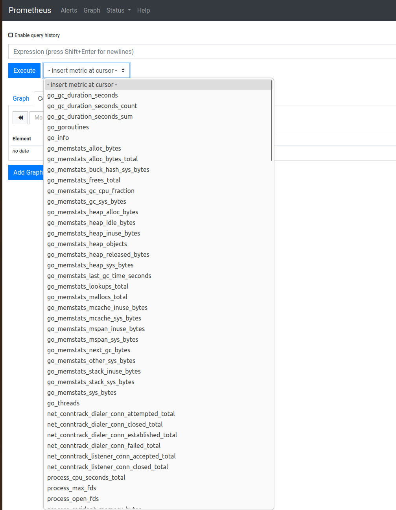
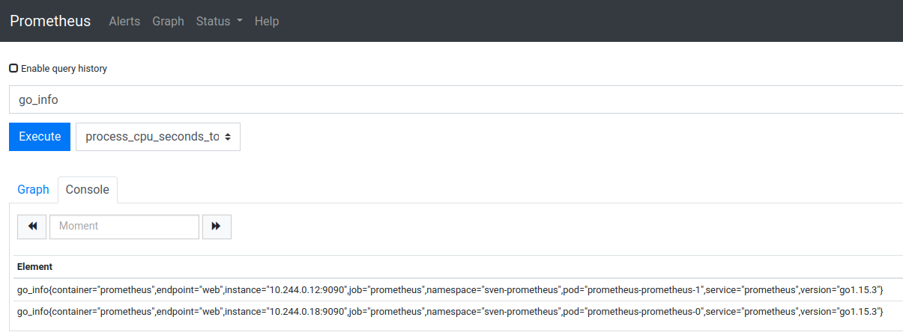

:construction:

Previously, I installed Prometheus and Grafana on my local cluster and set up Grafana to collect metrics from prometheus using a Datasource.

Now, I'll add some interesting metrics series to Prometheus.

## What's there

With a port-forward I can access the Prometheus UI from my browser:

```
$ kubectl port-forward -n sven-prometheus svc/prometheus 9090
Forwarding from 127.0.0.1:9090 -> 9090
Forwarding from [::1]:9090 -> 9090
Handling connection for 9090
Handling connection for 9090
```

Prometheus already provides a number of metrics about *itself*:




## Adding more metrics

Since there are already a few different observable applications on my cluster, I can probably add some interesting stuff, for example

- metrics about the Kubernetes cluster itself, the node it runs on
- flux
- postgres


### Kubernetes metrics

Sysdig provides [this](https://sysdig.com/blog/kubernetes-monitoring-prometheus/) guide, which it modestly calls `Kubernetes monitoring with Prometheus, the ultimate guide`. Sounds promising! Let's jump to [monitoring a Kubernetes cluster](https://sysdig.com/blog/kubernetes-monitoring-prometheus/#kube-state-metrics).

This guide points out the distinction between (1) kube-state metrics, which focus on orchestration metadata (deployment, pod, replica etc) and (2) metrics-server, which focuses on resource metrics (CPU, file descriptors, RAM, requests).

#### Node metrics

```
$ helm repo add prometheus-community https://prometheus-community.github.io/helm-charts
"prometheus-community" has been added to your repositories

$ helm install -n sven-prometheus sven-node-exporter prometheus-community/prometheus-node-exporter
NAME: sven-node-exporter
LAST DEPLOYED: Wed Aug 21 18:27:46 2024
NAMESPACE: sven-prometheus
STATUS: deployed
REVISION: 1
TEST SUITE: None
NOTES:
1. Get the application URL by running these commands:
  export POD_NAME=$(kubectl get pods --namespace sven-prometheus -l "app.kubernetes.io/name=prometheus-node-exporter,app.kubernetes.io/instance=sven-node-exporter" -o jsonpath="{.items[0].metadata.name}")
  echo "Visit http://127.0.0.1:9100 to use your application"
  kubectl port-forward --namespace sven-prometheus $POD_NAME 9100
```

Now a node-exporter pod is running on my cluster:

```
$ kubectl get pods --namespace sven-prometheus
NAME                                                READY   STATUS    RESTARTS       AGE
prometheus-operator-6b88448777-bgh5m                1/1     Running   13 (43h ago)   31d
prometheus-prometheus-0                             2/2     Running   12 (5h ago)    30d
prometheus-prometheus-1                             2/2     Running   12 (5h ago)    30d
sven-node-exporter-prometheus-node-exporter-scj5g   1/1     Running   0              33s
```

Let's put a port forward to the node exporter port in place, then grab some metrics:

```
$ kubectl port-forward --namespace sven-prometheus sven-node-exporter-prometheus-node-exporter-scj5g 9100
Forwarding from 127.0.0.1:9100 -> 9100
Forwarding from [::1]:9100 -> 9100

...

$ curl -s http://localhost:9100/metrics | head -n 30
# HELP go_gc_duration_seconds A summary of the pause duration of garbage collection cycles.
# TYPE go_gc_duration_seconds summary
go_gc_duration_seconds{quantile="0"} 2.6378e-05
go_gc_duration_seconds{quantile="0.25"} 3.9265e-05
go_gc_duration_seconds{quantile="0.5"} 6.2999e-05
go_gc_duration_seconds{quantile="0.75"} 9.6551e-05
go_gc_duration_seconds{quantile="1"} 0.000183818
go_gc_duration_seconds_sum 0.001203814
go_gc_duration_seconds_count 15
# HELP go_goroutines Number of goroutines that currently exist.
# TYPE go_goroutines gauge
go_goroutines 8
# HELP go_info Information about the Go environment.
# TYPE go_info gauge
go_info{version="go1.22.5"} 1
# HELP go_memstats_alloc_bytes Number of bytes allocated and still in use.
# TYPE go_memstats_alloc_bytes gauge
go_memstats_alloc_bytes 2.180168e+06
# HELP go_memstats_alloc_bytes_total Total number of bytes allocated, even if freed.
# TYPE go_memstats_alloc_bytes_total counter
go_memstats_alloc_bytes_total 3.0887824e+07
# HELP go_memstats_buck_hash_sys_bytes Number of bytes used by the profiling bucket hash table.
# TYPE go_memstats_buck_hash_sys_bytes gauge
go_memstats_buck_hash_sys_bytes 1.457764e+06
# HELP go_memstats_frees_total Total number of frees.
# TYPE go_memstats_frees_total counter
go_memstats_frees_total 201640
# HELP go_memstats_gc_sys_bytes Number of bytes used for garbage collection system metadata.
# TYPE go_memstats_gc_sys_bytes gauge
go_memstats_gc_sys_bytes 3.231232e+06
```

Right, so node-exporter is now providing metrics about my node.
Can I see these metrics in my prometheus UI?



Unfortunately, I can't. Why not?

Prometheus' scraping of metrics is configured in `prometheus.yaml`. Let's take a look at it:

```
$ kubectl exec -n sven-prometheus -it prometheus-prometheus-0 -- cat /etc/prometheus/prometheus.yml
# my global config
global:
  scrape_interval:     15s # Set the scrape interval to every 15 seconds. Default is every 1 minute.
  evaluation_interval: 15s # Evaluate rules every 15 seconds. The default is every 1 minute.
  # scrape_timeout is set to the global default (10s).

# Alertmanager configuration
alerting:
  alertmanagers:
  - static_configs:
    - targets:
      # - alertmanager:9093

# Load rules once and periodically evaluate them according to the global 'evaluation_interval'.
rule_files:
  # - "first_rules.yml"
  # - "second_rules.yml"

# A scrape configuration containing exactly one endpoint to scrape:
# Here it's Prometheus itself.
scrape_configs:
  # The job name is added as a label `job=<job_name>` to any timeseries scraped from this config.
  - job_name: 'prometheus'

    # metrics_path defaults to '/metrics'
    # scheme defaults to 'http'.

    static_configs:
    - targets: ['localhost:9090']

```


### Flux metrics


### Postgres metrics


